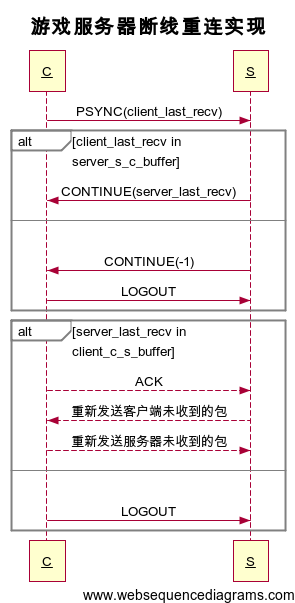

# 游戏服务器断线重连实现



	1. server_last_recv服务器最后收到的包序号
	2. client_last_recv客户端最后收到的包序号
	3. server_s_c_buffer服务器发送缓冲区
	4. client_c_s_buffer客户端发送缓冲区

[时序图](https://www.websequencediagrams.com)
```
title 游戏服务器断线重连实现

C->S: PSYNC(client_last_recv)
alt client_last_recv in server_s_c_buffer
    S->C: CONTINUE(server_last_recv)
else
    S->C: CONTINUE(-1)
    C->S: LOGOUT
end

alt server_last_recv in client_c_s_buffer
    C-->S: ACK
    S-->C: 重新发送客户端未收到的包
    C-->S: 重新发送服务器未收到的包
else
    C->S: LOGOUT
```